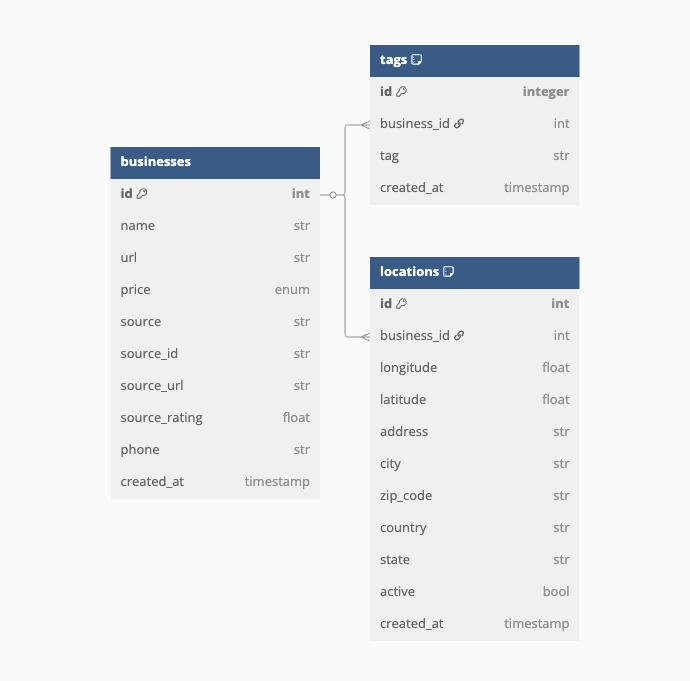

# Take home assignment

A FastAPI-based service that scrapes yelp data and answers natural language questions about local Bay Area businesses.

## About

- FastAPI service
- Pulls data from Yelp for set list of local Bay Area businesses
- Loads data to local SQLite database
- `/answer` route used to answer natural language questions about local businesses
- Asynchronous operations

## Prerequisites

- Python 3.12
- UV package manager

## Usage

### Installation

1. Clone the repository:

```bash
git clone <repository-url>
cd code-challenge-bounty-hunter
```

2. Run runner script (inits venv and install dependency with UV):

```bash
. ./run_api.sh
```

### Running ETL Process

To run the ETL process:

```bash
uv run run_etl.py
```

This pulls data for the businesses defined in `./data/business_list.csv`

### Running Sample Requests

To run sample requests, first have a running local instance of the API using `run_api.sh`:

```bash
uv run run_sample_requests.py 
```

There are 6 sample questions defined in the script, they will run concurrently. Feel free to add or modify any of the questions in the list to play around with the API.

#### Using the API Directly

You can also use any HTTP client like curl or Postman. Here's an example using curl:

```bash
curl -X POST "http://localhost:PORT-NUMBER/answer" \
     -H "x-api-key: YOUR-API-KEY" \
     -H "Content-Type: application/json" \
     -d '{"question": "What is the address of business X?"}'
```

### Environment Variables

The application uses environment variables for configuration, which can be set either in the system environment or in `.env` and `.secret` files located in the `src/env` directory. The `.secret` file contains sensitive information and should not be committed to version control (committed with real keys for demo purposes).

#### Settings Configuration

The application uses Pydantic's `BaseSettings` for configuration management. Settings are loaded in the following order:

1. System environment variables
2. `.env` file
3. `.secret` file

All settings are frozen (immutable) after initialization to prevent accidental modifications during runtime.

## Data Quality

Of the 100 businesses listed, 19 of them are either permanently closed, temporarily closed or were not listed on Yelp. An improvement that we can do her is to supplement the Yelp data with Google Places data as it provides a more comprehensive list of locations, however Google Places does not seem to have the same quantity of explicit attributes that Yelp data provides (i.e. does not tell you if business has wifi and whatnot).

On the note of data modelling, for the sake of timed element of the challenge, I simplified the modelling of the data for business attributes from ENUM to BOOL. I skipped all business attributes which I could not flatten down to a BOOL representation of that attribute.
For example: I simplified the `wi_fi` attribute to any value which is not `free` is considered to be `false` and the business does not fall into the "has_wifi" category. Of course, this is a simplification as it's possible that some businesses have paid wifi or provide wifi for paying customers only.

Another example: I skipped dealing with the `cost` attribute altogether to save time, however I could have modelled the ENUM nature of this attribute to a finite number of boolean flags (e.g. "is_cheap" = "$", "is_moderately_priced" = "$$", etc.)

### Summary of Current Limitations

- 19 out of 100 businesses are either:
  - Permanently closed
  - Temporarily closed
  - Not listed on Yelp

### Summary of Data Source Considerations

- Yelp provides rich attribute data but has coverage limitations
- Google Places offers better coverage but fewer explicit attributes
- Potential solution: Combine both data sources for comprehensive coverage

### Summary of Data Modeling Decisions

1. **Attribute Simplification**
   - Converted ENUM attributes to BOOL for simplicity
   - Skipped complex attributes that couldn't be flattened

2. **Examples of Simplification**
   - `wi_fi` attribute:
     - Only `free` values considered as `true`
     - All other values (paid, customer-only) marked as `false`
   - `cost` attribute:
     - Skipped in current implementation
     - Could be modeled as multiple boolean flags:
       - `is_cheap` = "$"
       - `is_moderately_priced` = "$$"
       - etc.

#### Data model



## Direction & Intention of Solution

### Full Thoughts

When first reading through the problem statement, there were many paths to take. The simplest and fastest one to implement would have been to create endpoints to answer a finite number of defined questions, much like previous generation FAQs bots. I considered this for the time element but thought it would have been a bit lackluster in terms of capability of a question answer product, especially in the age of generative AI.

Therefore I decided to go down the path of SQL generation and later down the line (if time permitted), query classification. In terms of query classification, there are generally 2 types of queries when it comes to question answering in a FAQ context:

1. Intent-based questions
2. Fact-based questions

The submission only tackles the latter.

For fact based questions, we can often answer them by translating natural language into SQL. This type of question answering is precise and reliable, however it is only as flexible as the data model allows it to be. What I mean by this is that if the data model does not contain the fields required to answer a certain question, then this SQL approach fails entirely and the question falls outside the capabilities of the bot.

```
E.g. 
Sucess
Q: What is the address of business X? -> SQL: select address from businesses_table where name = "X" -> A: 123 abc street

Fail
Q: Which stores have pasteries? -> If "has_pasteries" is not a flag, then the question is not answerable.
```

For future development, all questions which fall outside the data model can be searched up using a semantic search engine, albeit with less precision. The solution I had in mind for this would have been to use a vector database (e.g. Qdrant or Pinecone) and embed different elements of a business into different collections of points.

For example, an embedding collection facts and attributes of businesses and an embedding for user reviews which have exanded descriptions which may have key words in them about business attributes.

Following this model, we would need a question classifier to determine if the question is supported by the data model.

#### Simple diagram


### Summary of Current Implementation

The solution focuses on fact-based questions using SQL generation:

```sql
-- Example: Business address query
SELECT address 
FROM businesses_table 
WHERE name = 'X';

-- Example: Pastry availability query (not supported)
SELECT name 
FROM businesses_table 
WHERE has_pastries = true;  -- This field doesn't exist
```

#### Future Improvements

1. **Query Classification**
   - Implement intent-based question handling
   - Add semantic search capabilities

2. **Vector Database Integration**
   - Use Qdrant or Pinecone for semantic search
   - Create separate collections for:
     - Business facts and attributes
     - User reviews with expanded descriptions

3. **Question Classifier**
   - Determine if question is supported by data model
   - Route to appropriate processing method
